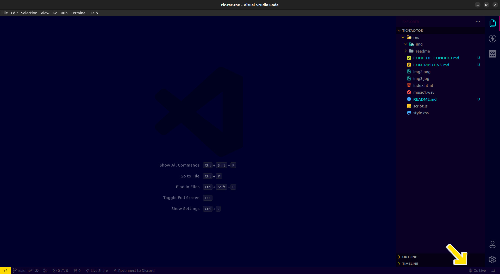

# <p align="center">Tic Tak Toe</p>

<p align="center">
<strong>Tic Tac Toe</strong> project offers a game of Tic Tac Toe with two distinct modes. In the first mode, you can challenge an AI opponent that employs the Minimax algorithm, making it nearly unbeatable. The second mode is designed for playing against a friend. Additionally, the game features a scoring system and a user-friendly interface, ensuring a pleasant and convenient gaming experience.
</p>

<p align="center">
<a href="https://github.com/srbmaury/tic-tac-toe/blob/main/LICENSE" target="blank">

</a>
<a href="https://github.com/srbmaury/tic-tac-toe/fork" target="blank">

</a>
<a href="https://github.comsrbmaury/tic-tac-toe/stargazers" target="blank">

</a>
</p>

## Table of Contents

- [Getting Started](#getting-started)
- [Features](#features)
- [Contributing](#contributing)
- [License](#license)
- [Contact](#contact)

## Getting Started

To get started with the game, follow these steps:

1. Clone the repository to your local machine.

   ```terminal
   git clone https://github.com/srbmaury/tic-tac-toe.git
   ```

2. Change the directory

   ```terminal
   cd tic-tac-toe
   ```

3. Open the folder in VS Code.

   ```terminal
   code .
   ```

4. Run the project with live server located at the bottom right corner of the project.

   

5. Enjoy playing Tic Tac Toe!

## Features

- Single-player mode with an unbeatable AI opponent.
- Multiplayer mode for playing with a friend.
- Scoring system to keep track of your performance.
- User-friendly interface for seamless gameplay.

## Contributing

We welcome contributions! If you'd like to contribute to this project, please read our [Contributing Guidelines](CONTRIBUTING.md) for instructions on how to get started.

## License

This project is licensed under the [MIT License](./LICENSE).

## Contact

If you have any questions or need assistance, feel free to contact us at [srbmaury@gmail.com](mailto:srbmaury@gmail.com).

Happy gaming!
